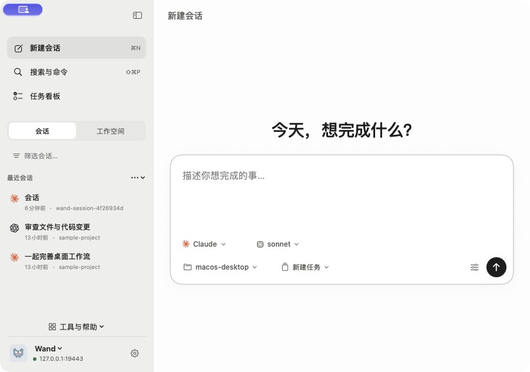
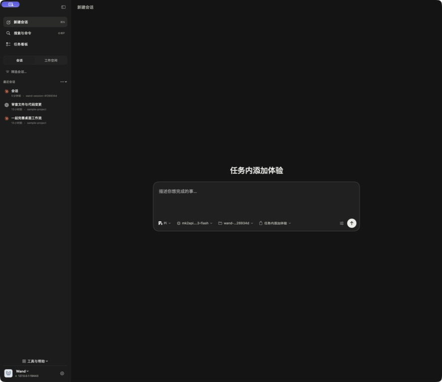

# macOS 输入区与创建流程验收

版本：4.71.2-debug.09212253。延续此前窗口尺寸与菜单简化，本轮只调整原生 macOS 创建体验。

## 设计收敛

采用已安装的 frontend-design / frontend-design-premium 与 emil-design-eng；遵循用户指定的简洁输入区。

| Before | After | Why |
| --- | --- | --- |
| 输入首页后进入下一步配置 | 首页输入框底部直接选择并启动 | 保持一个连续操作 |
| 工具、模型、目录、任务及高级设置全部展开 | 工具、模型、目录、归属作为底部小按钮；其余按需展开 | 默认页面聚焦输入 |
| 任务、目录、全局添加分别进入不同界面 | 全部进入同一右侧创建区 | 上下文预填且行为一致 |
| 任务添加可能继承项目根路径 | 获取任务实际 cwd 后绑定会话 | 正确使用独立工作树 |

## 已执行

- 原生 Release 编译与完整 50 项 XCTest：通过，0 failures。新增 HTTP 契约测试使用 URLProtocol，不触发真实 AI。
- 在隔离服务的实际原生窗口验证：首页读取 Claude、Sonnet 默认模型、deep 思考深度、structured、managed 和关闭独立工作树的默认值。
- 目录优先取服务器 defaultCwd，未被不同的最近工作树路径替换；目录加号预填项目路径。
- 任务加号直接显示统一创建区，归属和真实工作树目录已预填。启动空提示词结构化会话后进入所属任务；GET session 验证 workspaceTaskId、cwd、selectedModel=sonnet、thinkingEffort=deep、mode=managed。
- 首页多行草稿切到任务看板再回来保持原文。
- 最终紧凑布局：浅色最小窗口 900 × 632 pt、深色大窗口均可显示输入和启动；小窗口底部按钮自动分两行。
- 任务按钮仅点击后展示任务选择、名称及独立工作树；Escape 关闭并恢复输入焦点。
- 最终提交检查修复原生 NSTextView 未遵循 disabled 的问题，并在启动时同步捕获提示词。
- designmd lint：0 errors / 0 warnings；premium strict audit：0 findings。审计脚本不验证 SwiftUI 视觉，原生截图与 XCTest 是主要证据。

## 验证边界

已有任务创建闭环与草稿往返在同一逻辑的大表单阶段实测；随后只收敛为底部弹出选项，最终布局补做实机截图、弹层、Escape 和小窗口检查。
没有对真实服务发起新的 AI 工作；实际用户接管体验窗口后不再注入测试操作。
未声称已覆盖完整中文输入法候选矩阵、所有 provider 的在线推理、VoiceOver 全流程或无障碍认证。
后端创建结构化会话并发送首条消息时，若首条消息执行失败，当前协议可能不返回已创建会话 ID；本轮保证新任务创建成功后重试不重复建任务，不能保证该后端失败路径不重复建会话。

## 截图

## 分发与安装

Universal arm64 + x86_64 构建、ad-hoc 签名和 DMG 校验通过。已安装到 Applications；实际服务器连接与首页已在安装版核对。全局 macOS 更新目录包含 DMG、ZIP 和更新清单，更新接口返回本版本。

| 文件 | 字节 | SHA-256 |
| --- | ---: | --- |
| wand-v4.71.2-debug.09212253.dmg | 11524827 | `9754aafef3c055a86503c10f8bef72de409e27ffd25896dd5732c7c1f8253f46` |
| wand-v4.71.2-debug.09212253.zip | 8948347 | `ffab1535b11a9209017aaad7a07577b1f058e1c94f897b7c68993dd870cfcecf` |
