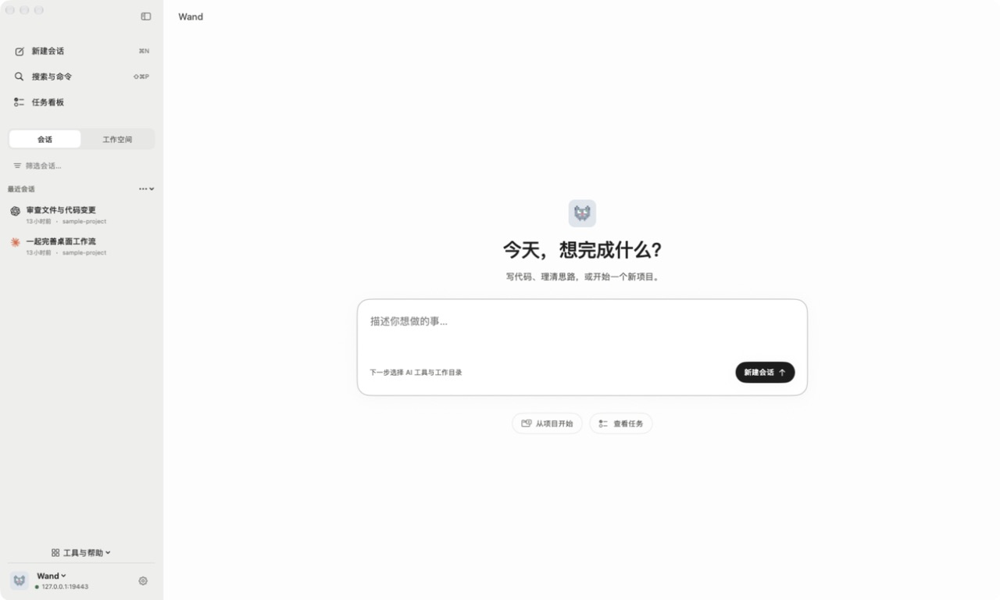
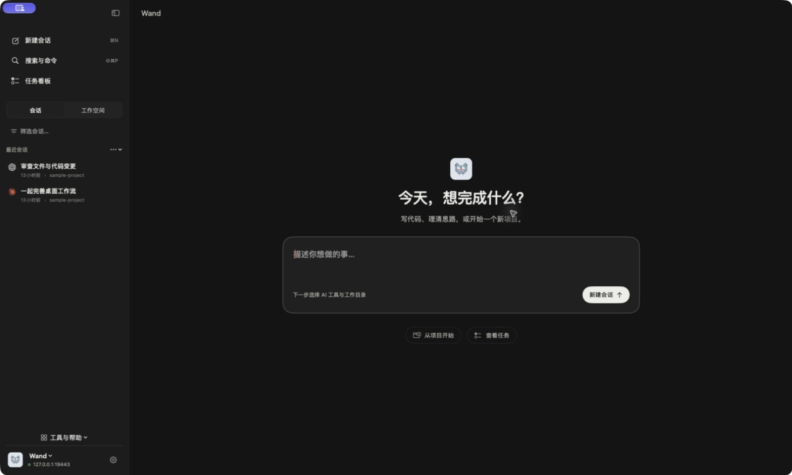
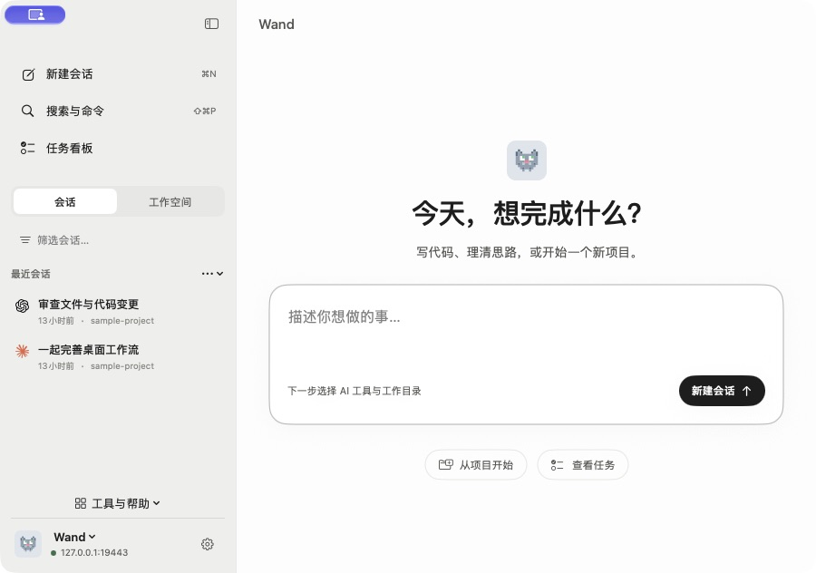
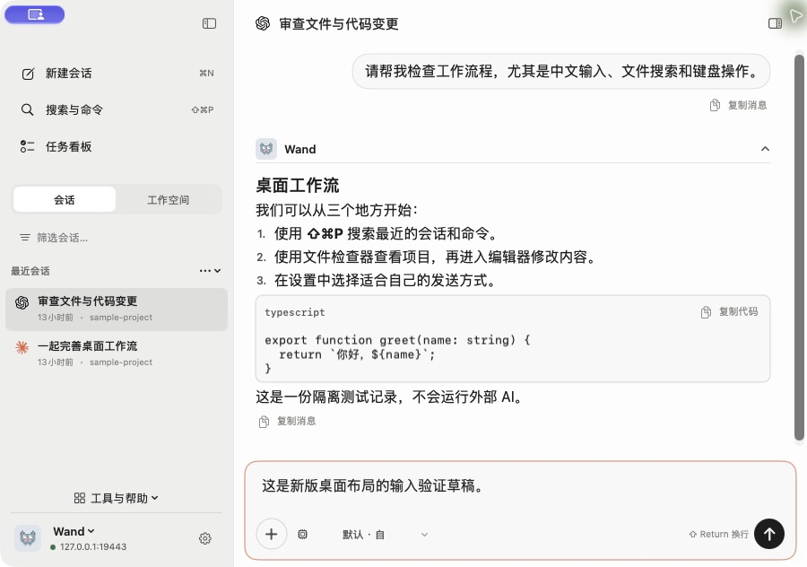
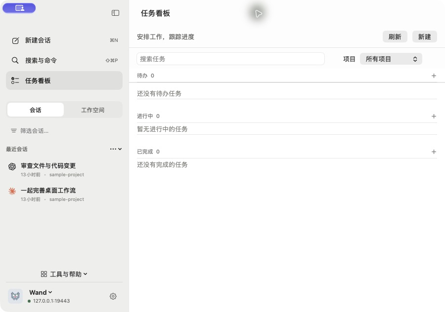
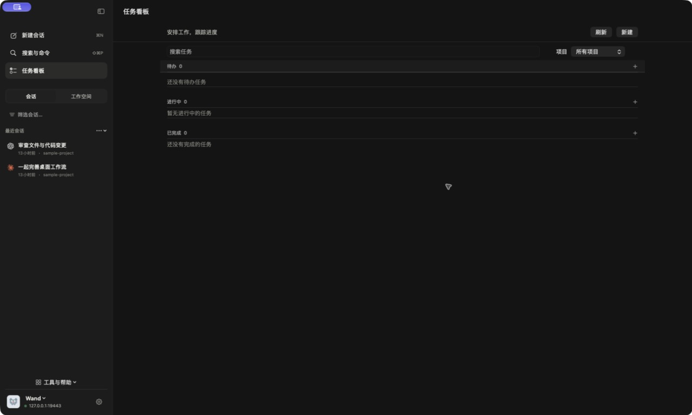

# macOS 桌面产品整合 · 2026-09-21

## 交付

版本 `4.71.2-debug.09212220`，Universal Binary（arm64 + x86_64），沿用 ad-hoc 签名。
已替换本机应用程序目录中的 Wand，并部署到默认实例的 macOS 分发目录。
未发布 GitHub Release。旧应用的完整回滚副本保留在本机临时目录。

- 默认窗口从 1440 × 880 改为 1600 × 960 pt，大屏按可用区域扩展至最多 1920 × 1120。
- 左侧由七个主入口收敛到新会话、搜索、任务看板；会话与工作空间使用同一区域切换。
- 连接与品牌归入底部；工具与帮助集中为一个菜单。标题区只显示页面标题与相关文件入口。
- 系统菜单的「前往」并入「显示」子菜单；搜索、查找与输入焦点放入「编辑」。快捷键保持可用。
- 首页提供真实多行输入，Command-N / Command-L 聚焦；继续会带入会话配置，取消保留首页草稿。
- 任务看板在主窗口切换；深色列表使用同一工作区背景。
- 重新登录 sheet 携带完整请求，修复首次呈现丢失服务器上下文的问题。

## 自动验证

- Xcode Debug test：44 项通过，0 失败。含大屏 / 笔记本 / 超宽屏初始几何、离屏恢复、登录错误分类及 NSTextView 焦点输入回归。
- 最终 Universal Release 构建成功；已安装二进制确认为 arm64、x86_64。
- codesign --verify --deep --strict 通过；hdiutil verify 校验通过。
- Premium strict 文档契约检查无错误或警告；DESIGN.md lint 无错误或警告。该审计不解析 SwiftUI，不能替代实机检查。
- 本地更新接口返回 latestVersion=4.71.2-debug.09212220、fileName=wand-v4.71.2-debug.09212220.dmg、source=local。

| 文件 | 字节 | SHA-256 |
| --- | ---: | --- |
| DMG | 11255032 | 9ee29926538c2a428827ae359c0dd84e9d9344c3a50de797309a96c6e6719f5c |
| ZIP | 8738525 | 2c59f464e869d345aa4b75146b8a6f6e97fd67bb74768ffe8bebf0896f3b9318 |

## 真机结果

在隔离服务中使用测试会话，通过原生 UI 操作并截图：

- 首次窗口在超宽显示器上为 1920 × 1120；人工配置的 1600 × 960 与最小外框 900 × 632 正常显示。
- 系统菜单四分屏得到 1688 × 706，退出后重启保留该位置与尺寸。
- 双击顶部缩放、进入全屏、从系统显示菜单退出全屏通过；退出后保留普通窗口尺寸。
- 首页中文多行内容经 Command-Return 带入已有会话配置；Escape 取消后原草稿仍在。
- Command-N 从会话回到首页并直接接收中文输入；Command-L 可聚焦会话输入。
- Command-3 进入内嵌任务看板，点击侧栏会话返回聊天；当前选中状态相应更新。
- 小窗口下文件检查器作为覆盖面板打开、关闭；聊天输入仍保留。
- 设置直接打开；浅色、深色切换，Escape 关闭；最终包的深色看板没有多余的整块背景。
- 实际安装版保留了原服务器地址。旧凭据已经失效；重新登录入口正确显示获取新连接码的说明，取消不清除原连接。

## 明确边界

自动化多次执行顶部拖动及边缘拖动后，窗口位置 / 尺寸没有产生预期变化，因此这两项**未验证通过**。
没有据此改用自制窗口移动逻辑；仍由 NSWindow 原生拖动处理，标题区域支持首次鼠标事件。
系统菜单调整、双击缩放与尺寸恢复通过，不替代拖拽验收。

此次验证没有向真实 AI 发送消息或创建生产任务；中文粘贴、换行与焦点检查不等于覆盖所有输入法候选操作。
没有执行完整 VoiceOver / 各 macOS 版本认证。旧连接的有效新连接码仍需用户在已打开的安装版中提供。
截图左上方出现的紫色指示是系统屏幕共享提示，不属于 Wand 窗口组件。

## 截图

完整首页与深色看板来自最终交付包；小窗口截图来自同一轮界面实现，最后仅增加登录 sheet 请求修正与看板背景修正。

