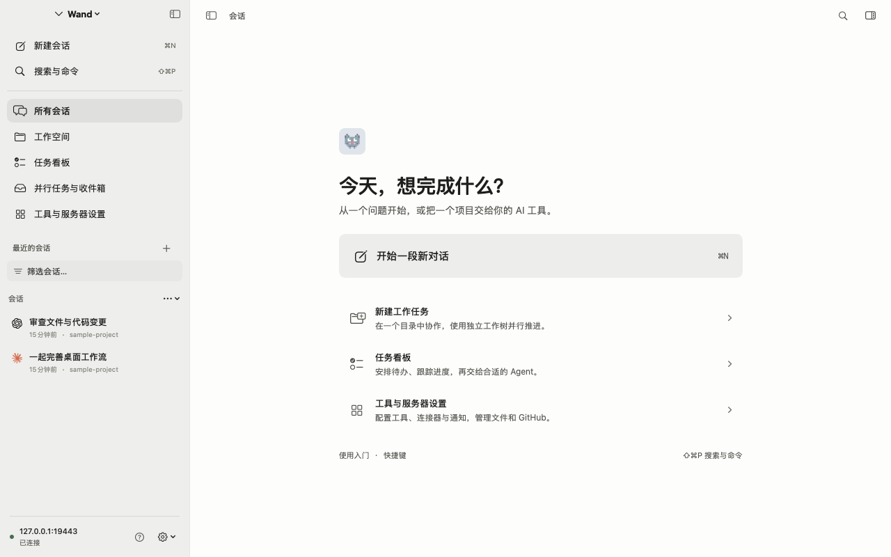
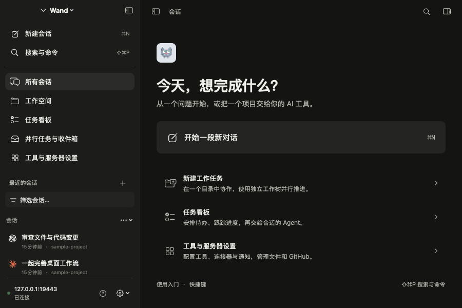
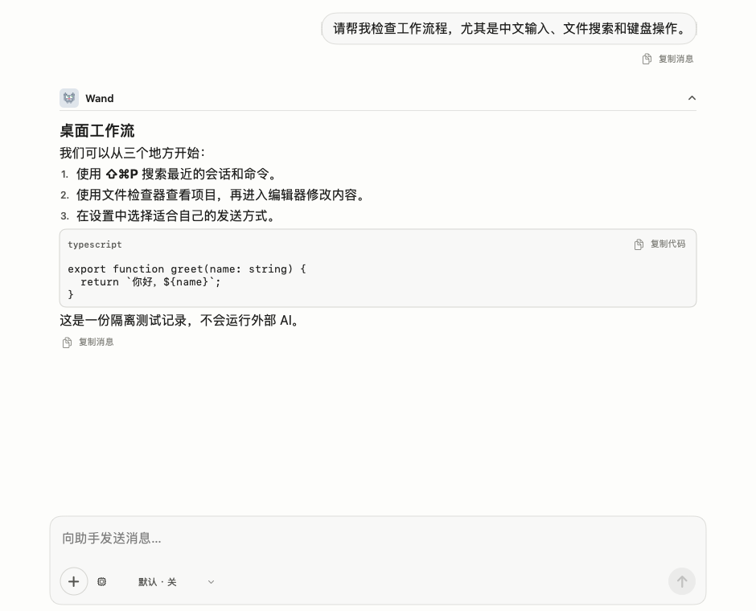
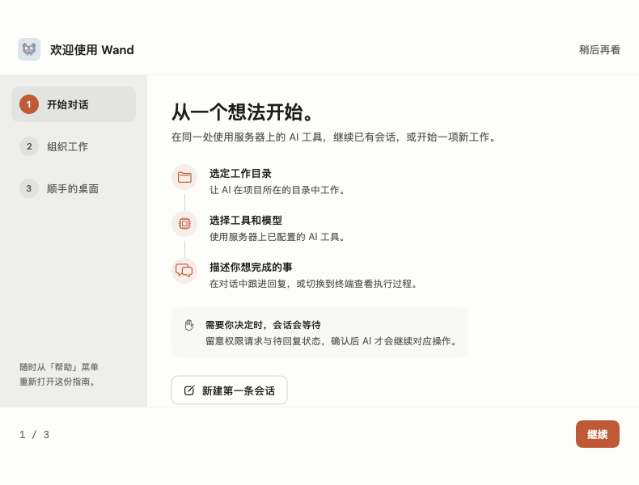

# 桌面重构验证记录

2026-09-21，macOS 27 SDK / Xcode 27 beta，最低目标仍为 macOS 12。

## 已执行

- Debug 构建和 build-for-testing 成功；通过 Xcode 独立 xctest 运行 27 项测试，零失败。
- 新增 9 项会话回归：草稿隔离、附件、失败恢复、切换后失败、输入法提交策略、查找与 Unicode。
- 新增 4 项旧服务历史兼容回归：部分失败、空响应、来源标记、禁止误路由。
- 主仓库 `npm run check`、`npm test`（967 项）、`npm run build` 与内联 gzip 预算通过。
- 桌面 Web 桥接 5 项测试包含真实文件编辑 controller 的非当前标签草稿、保存中保护和实时会话选择。
- 浅色、深色、900×600 / 1280×800 主壳、聊天、连接、指南、设置、命令面板通过真实 SwiftUI 离屏渲染检查。
- 离屏主壳、聊天、命令面板连接隔离服务器，真实 API 登录、会话列表和聊天快照成功；测试数据未调用外部 AI。
- DESIGN lint 0 错误；文档 strict 审计 0 项（审计器不解析 Swift）。

## 截图

这些是 NSHostingView 离屏渲染，包含 App 的真实资源和隔离测试数据；不是交互式系统窗口截图。

## 明确未通过的运行验证

本机自动化工具对 Wand 与 Chrome 都返回 `cgWindowNotFound`；Xcode testmanagerd 也无法建立连接，
因此测试 bundle 使用直接 xctest 运行。离屏渲染不能验证真实菜单/焦点、中文候选窗口、系统 sheet、
拖拽、VoiceOver、动画触感或端到端的权限交互。正式验收仍需在可交互桌面补验这些项目。
没有实际调用六种付费 provider、提交 Git、发送 GitHub Issue 或修改用户服务器安全设置。

高级工具通过服务器提供的 Web 页面运行；它们不是全量 SwiftUI 重写。
文件定位和草稿关闭检查需要本次服务端桥接；旧服务器可使用完整控制台，兼容提示会解释缺失能力。
草稿目前仅在 App 进程内保存，应用退出与 Web 重载不属于工具 sheet 的关闭保护范围。
