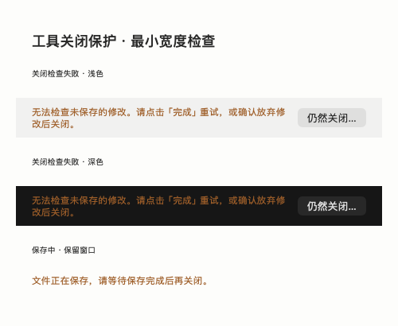

# 桌面重构验证记录

2026-09-21，macOS 27 SDK / Xcode 27 beta，最低目标仍为 macOS 12。

## 已执行

- 初轮 Debug 构建和 build-for-testing 成功；通过 Xcode 独立 xctest 运行 27 项测试，零失败。续验发现工程重复文件 ID 曾漏编工作空间测试，修复后结果见下文。
- 新增 9 项会话回归：草稿隔离、附件、失败恢复、切换后失败、输入法提交策略、查找与 Unicode。
- 新增 4 项旧服务历史兼容回归：部分失败、空响应、来源标记、禁止误路由。
- 主仓库 `npm run check`、`npm test`（967 项）、`npm run build` 与内联 gzip 预算通过。
- 桌面 Web 桥接 5 项测试包含真实文件编辑 controller 的非当前标签草稿、保存中保护和实时会话选择。
- 浅色、深色、900×600 / 1280×800 主壳、聊天、连接、指南、设置、命令面板通过真实 SwiftUI 离屏渲染检查。
- 离屏主壳、聊天、命令面板连接隔离服务器，真实 API 登录、会话列表和聊天快照成功；测试数据未调用外部 AI。
- DESIGN lint 0 错误；文档 strict 审计 0 项（审计器不解析 Swift）。

## 截图

这些是 NSHostingView 离屏渲染，包含 App 的真实资源和隔离测试数据；不是交互式系统窗口截图。

## 续验与修复

2026-09-21 09:36：

- 同一服务器更换连接码或重新登录时，使用新的进程内连接标识重建会话、工作空间及 WebSocket 状态，避免继续使用旧凭据。
- 文件草稿关闭检查发生 JavaScript 异常或返回未知状态时保留窗口；可以重试，或明确确认放弃修改后关闭。保存中仍阻止关闭。
- 系统菜单切换服务器不再穿透工具/编辑弹窗。
- 修复 XCTest.framework 和 WorkspaceTaskContractTests.swift 的重复 Xcode 文件 ID，补全测试模块导入；原有 6 项工作空间测试现已实际编译运行。
- 新增 5 项连接生命周期和关闭保护回归，原生共 38 项测试全部通过；Web 工具桥接 5 项测试全部通过。
- Debug build-for-testing 和 Universal Release 构建成功，arm64/x86_64、ad-hoc 签名、DMG 校验和通过。
- strict 静态审计 0 项；关闭保护提示在浅色、深色和 460 pt 内容宽度下完成真实 SwiftUI 离屏渲染检查。该检查不替代弹窗交互验收。

分发版本：`4.71.2-debug.09210935`。DMG、ZIP 和更新清单已部署到本机 macOS 分发目录。
全局服务启用本地 macOS 分发后，`/api/macos-dmg-update?currentVersion=0.0.0` 返回该版本及对应文件名，
`source` 为 `local`；实际下载字节的 SHA-256 与清单一致，无需重启服务。

| 文件 | 字节数 | SHA-256 |
| --- | ---: | --- |
| `wand-v4.71.2-debug.09210935.dmg` | 11,164,579 | `04bb8b1aa88524639546317390a6ff4af1e96b0f5a371e42251c37c5e8caff66` |
| `wand-v4.71.2-debug.09210935.zip` | 8,656,829 | `ad6ea980c2fed057b22b64e6968523fab38df6dd9f1c114aa51893276cb906ab` |

本机分发供浏览器和兼容端点下载；App 自带的自动更新仍查询官方 GitHub Release，本次没有发布 GitHub Release。

## 明确未通过的运行验证

本机自动化工具对 Wand 与 Chrome 都返回 `cgWindowNotFound`；Xcode testmanagerd 也无法建立连接，
因此测试 bundle 使用直接 xctest 运行。离屏渲染不能验证真实菜单/焦点、中文候选窗口、系统 sheet、
拖拽、VoiceOver、动画触感或端到端的权限交互。正式验收仍需在可交互桌面补验这些项目。
续验再次尝试选取已构建的 Wand 应用窗口，仍返回 `cgWindowNotFound`。
没有实际调用六种付费 provider、提交 Git、发送 GitHub Issue 或修改用户服务器安全设置。

高级工具通过服务器提供的 Web 页面运行；它们不是全量 SwiftUI 重写。
文件定位和草稿关闭检查需要本次服务端桥接；旧服务器可使用完整控制台，兼容提示会解释缺失能力。
草稿目前仅在 App 进程内保存，应用退出与 Web 重载不属于工具 sheet 的关闭保护范围。
