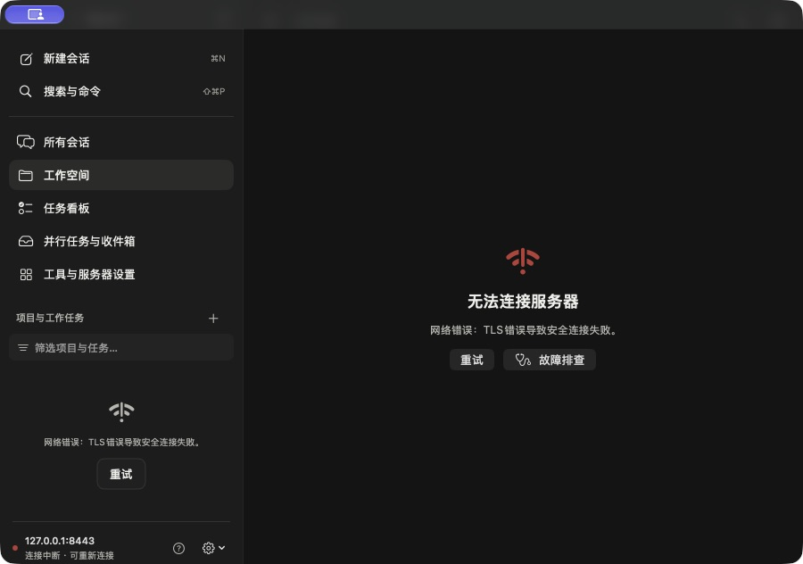
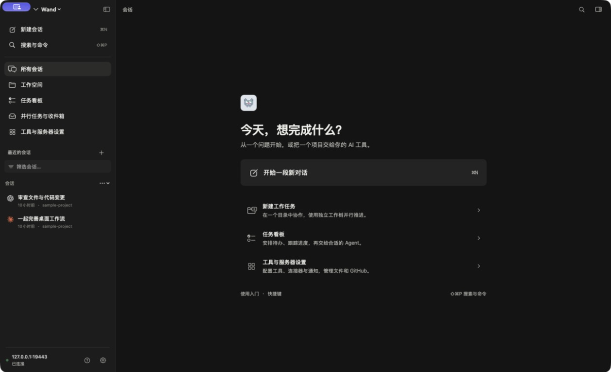
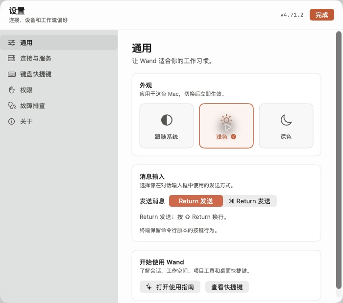
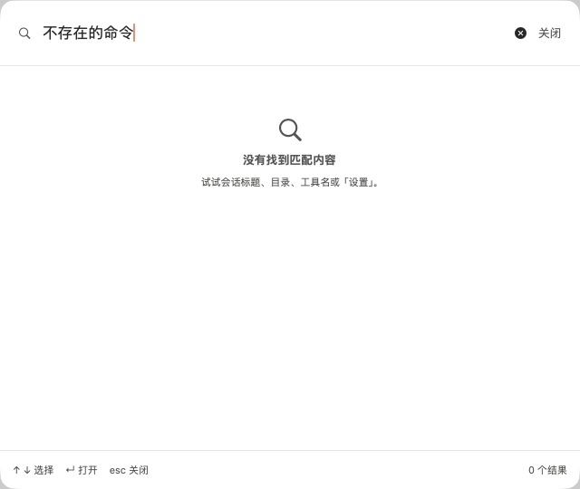
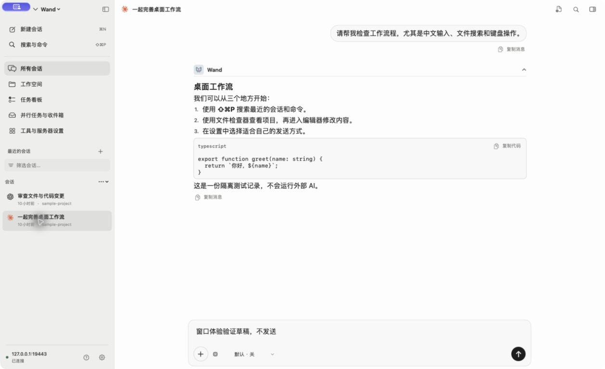
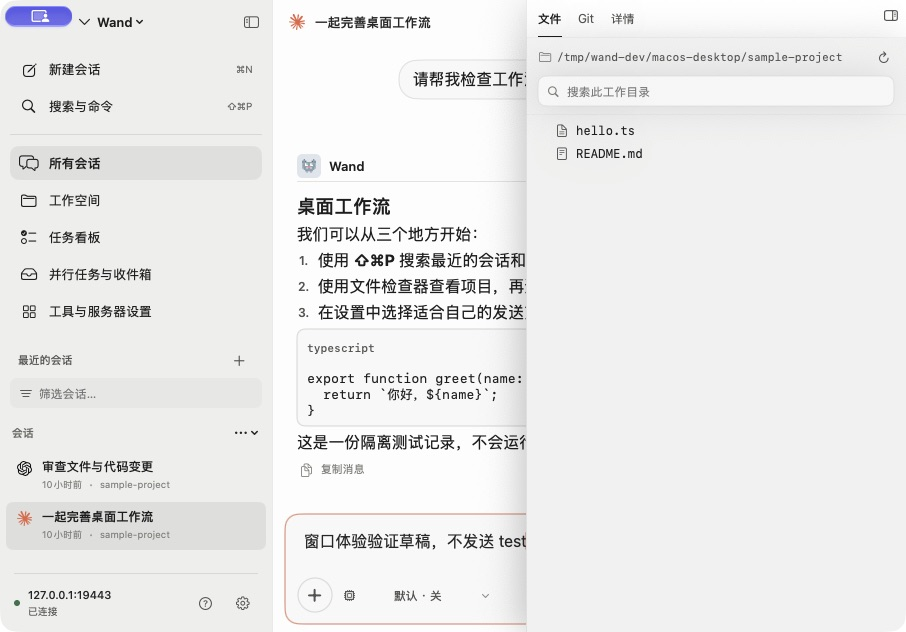

# macOS 实机体验修正

2026-09-21；使用原生 Computer Use 操作真实 Wand 窗口。网络流程使用隔离测试服务器和已有演示会话，没有调用外部 AI。

## 实机步骤与结果

1. **启动与标题栏：修复后通过。** 已安装旧版和当前源码都打开为约 900 × 632 pt；标题栏覆盖自绘按钮。
   Scene 使用 hiddenTitleBar 后首次打开为 1440 × 880 pt，按钮可见，聊天标题合并为同一行。
   下图分别是当前源码修复前的错误状态与修复后连接成功状态；用于展示窗口几何，不是同一业务状态的像素比较。
2. **设置、外观与搜索：通过。** 设置按钮直接进入设置；浅色/深色、Escape 关闭、Command-Shift-P 打开搜索、
   中文粘贴检索与无结果状态均实际操作。系统应用菜单保留原生窗口管理与快捷键。
3. **聊天输入与切换：通过。** 修复未绑定控件的 FocusState 后，Command-L 与鼠标均能聚焦；
   中文粘贴、英文键入有效。两个演示会话来回切换，草稿恢复且没有提交。
4. **紧凑窗口与检查器：通过。** 系统平铺后拖动右下角缩到约 906 × 632 pt；检查器从常驻转为覆盖，保持打开；
   Command-Option-I 关闭后，消息和输入恢复完整可用宽度。设置关闭与弹窗滚动可用。
5. **最终尺寸记忆和登录恢复：待解锁复验。** 实机发现 SwiftUI 会覆盖 AppKit frame autosave 名称；
   最终改为独立保存窗口几何并监听移动/缩放，加入全屏过渡保护。最终二进制启动前 Mac 锁屏，
   两次 Computer Use 均无法解锁，因此独立尺寸恢复、最终拖拽区域与 401 → 重新登录 → 取消/成功流程未完成实机复验。
   401 与网络错误分流、屏幕边界和恢复几何有自动化覆盖。

## 验证

- 最终 Xcode test 成功：43 项，零失败；包含新增的窗口几何、认证错误分流与原生文本焦点测试。
- Release 编译与 Universal 分发构建成功：arm64 / x86_64，ad-hoc 签名校验成功，DMG 校验和通过。
- DESIGN.md lint：零错误、零警告。原生契约 strict 审计零项；审计器不解析 Swift，不能替代运行检查。
- 修改仅在 macOS 子仓库；未修改 Android 或 iOS。
- 未验证完整中文候选窗口、VoiceOver、真实 AI 发送、PTY 和所有任务业务流程；本次不宣称覆盖这些行为。
- 已安装的旧版本尚未替换；桌面锁屏阻止退出旧实例并启动新版本。

## 分发

版本 `4.71.2-debug.09212031`，DMG、ZIP 和更新清单已部署到 macOS 本地分发目录。
`/api/macos-dmg-update?currentVersion=0.0.0` 返回相同版本和 DMG 文件名，来源为 local。
App 自带更新仍查询 GitHub Release；本次没有发布公开 Release。

| 产物 | 字节数 | SHA-256 |
| --- | ---: | --- |
| DMG | 11172676 | fe17a87a8ae9723cd2a83a08ef343a1d76b22bf7ca5e722e781322449f697906 |
| ZIP | 8670522 | 6756f2182db208a994b8fb2f7b45cf6804508c3d033d9edea6f756a36e1eaedf |

## 本次真实窗口截图

截图左上紫色标记来自系统屏幕共享指示，非 Wand 绘制。

