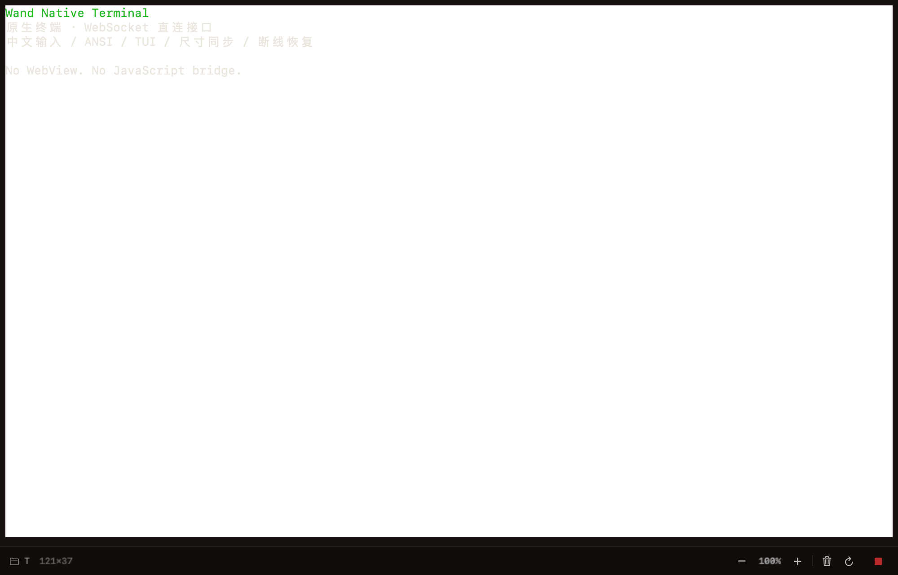
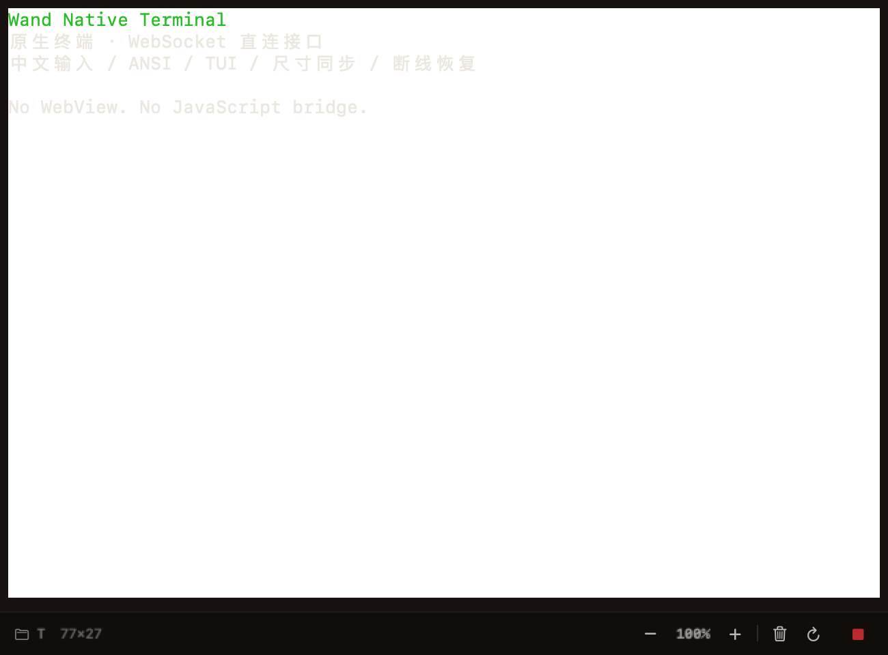

# 原生终端验收 · 2026-09-22

## 实现与范围

PTY 页面改为 SwiftTerm AppKit 原生视图直连 Wand `/ws`。保留原生权限卡片和底栏，
不修改服务器 PTY 所有权、结构化 runner、Android 或 iOS。

## 已执行

- Debug 编译通过；完整 XCTest 宿主执行 101 项、0 失败，包含 14 项终端测试。
- 使用私密连接文件指定的本机已安装服务（未另建服务）：创建专用临时 shell，
  验证真实中文/ANSI 输出、文本与单独 Return、`stty size` 尺寸同步、快照 resync、
  原生断开/重连、TUI 备用屏幕进入/退出。测试会话在完成或失败后删除，不操作用户既有会话。
- 实际 `PtySessionView` 挂载原生窗口，连接同一真实服务测试会话，检查 1000×640 与
  650×480 的终端与状态栏；截图为运行时原生视图捕获，不是网页或静态设计。
- 删除旧桥接后再次运行：Debug build-for-testing、完整原生测试与真实服务用例全部通过（101 项），
  主仓库 `npm run check`、`npm test`（1,069 项）、`npm run build` 通过，Web gzip 预算检查通过。

截图只保留刻意输出的测试文本；不包含连接码、token、主机信息或用户工作内容。

## 验证边界

- 本机 `xcodebuild test` 无法连接 `com.apple.testmanagerd.control`（error 3）。
  使用仓库已采用的 XCTest bundle 注入宿主方式执行同一 `WandTests.xctest`，不是跳过测试。
- 当前命令环境的系统 pasteboard 无法完成读写。已验证原生粘贴文本路径的 bracketed-paste
  包围、不附回车与空内容不发送，但不能据此声称系统 Command-C/Command-V 已人工通过。
- 已测试 NSTextInputClient 预编辑不发送、带属性中文提交、独立 Return 和控制键；
  中文候选窗口换词/确认、VoiceOver 以及六种 provider 的全部 TUI 仍需交互式应用人工复核。
- 未关闭沙箱、Xcode 插件验证或签名验证来绕过上述限制。

## 删除与分发

- 全仓引用检索确认 macOS `WebContainerView` / `WebBridge` 无调用方，原生实际页面使用
  `NativeTerminalView`；iOS 同名实现仍有调用方，保留不动。
- 独立删除提交 `d7da771` 仅删 681 行：两个旧 WebView/JS 桥接文件 655 行，Xcode 引用 8 行，
  无调用的终端 composer 包装 6 行，WebView 专属底色 7 行，PTY 页面不再使用的字段/赋值 5 行。
- `./build.sh 4.72.1-debug.09221233` 成功生成 Universal（arm64 + x86_64）App、ZIP、DMG 与更新清单。
  `codesign --verify --deep --strict` 和 `hdiutil verify` 通过；SwiftTerm 资源包与 MIT notice 已在 App 内，
  主可执行文件不再链接 WebKit.framework。
- 三份分发文件已部署至 `~/.wand/macos/`；指定已安装服务的
  `/api/macos-dmg-update?currentVersion=0.0.0` 返回 `latestVersion=4.72.1-debug.09221233`、
  `source=local`、`updateAvailable=true`。此为本地分发，不是 GitHub 正式发布。
- App 位于 `build/Wand.app`，安装镜像位于 `dist/wand-v4.72.1-debug.09221233.dmg`。
  没有覆盖用户当前安装的 App，也没有重新发布 npm 或改动其他原生平台。
