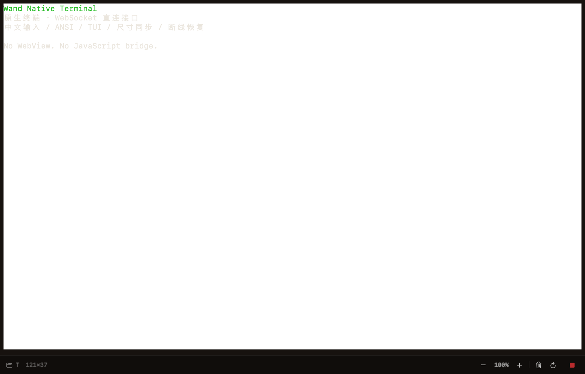

# 原生终端交互回归 · 2026-09-23

承接 [首轮验收](../native-terminal-2026-09-22/verification.md)。本轮只修改 macOS 原生终端，
不修改服务器、Android、iOS，不替换用户当前安装的 App。

## 已复现并修复

1. SwiftTerm 默认允许鼠标上报，普通 shell 即使没有启用鼠标模式，每次输出也会取消选区。
   现在仅在普通缓冲区解析输出期间保留选区，不永久关闭 TUI 鼠标支持；切换到 TUI 或恢复快照时清除旧选区。
2. Kitty 增强键盘模式在咨询输入法前编码 Return 等功能键，导致中文候选确认/释放事件可能到达远端。
   现在由当前焦点终端的 AppKit **局部**事件监听先交给输入法，并过滤该事件的命令回退与释放；
   已提交中文按原文发送。没有全局键盘监听、依赖补丁或关闭系统保护；应用 Command 快捷键仍走响应链。

先记录失败断言，再修复。新增 6 个回归用例，覆盖选区和历史滚动、快照选区失效、TUI 鼠标模式、
增强键盘下的候选确认/释放、应用快捷键及初始组词键释放、中文原文提交。
这些是 NSTextInputClient / NSEvent 路由测试，**不冒充实际中文候选窗口操作**。

## 已执行验证

- Debug `build-for-testing` 通过；完整 XCTest 宿主执行 **107 项、0 失败、0 跳过**，其中终端测试 20 项。
  本机 testmanagerd 的连接限制仍在，沿用 XCTest bundle 注入宿主运行，没有跳过测试或关闭签名检查。
- 显式开启已安装服务用例，从私密验收连接文件读取配置。专用临时 shell 的中文/ANSI、独立 Return、
  `stty size`、resync、断开重连、备用屏幕检查通过，结束删除测试会话，未操作用户原有会话。
- 同一用例重新挂载实际 `PtySessionView` 并捕获两种尺寸的原生视图；仅含专用测试文本，无凭据或用户内容。
  这是运行时视图捕获，不是通过桌面自动化完成的全应用验收。
- 主仓库 `npm run check`、`npm run build`（含 bundle 预算）通过。
  首次 `npm test` 遇到 `structured-runner-seam.test.ts` 的 Codex 用例结束后异步 `write EPIPE`，
  该后端文件没有改动。定点连续三次复跑通过，随后独立全量重跑 **1,069 项通过**；
  保留此偶发失败记录，不宣称已修复后端竞态。

## 分发

- `./build.sh 4.72.1-debug.09230635` 生成 Universal App（arm64 + x86_64）、ZIP、DMG 与更新清单。
- `codesign --verify --deep --strict`、`hdiutil verify`、资产大小和 SHA-256 核对通过。
  SwiftTerm 资源包与第三方许可完整，主程序不链接 WebKit。
- 三份分发文件部署到 `~/.wand/macos/`；指定已安装服务的
  `/api/macos-dmg-update?currentVersion=0.0.0` 返回
  `latestVersion=4.72.1-debug.09230635`、`source=local`、`updateAvailable=true`。
- 可运行 `build/Wand.app`，安装包 `dist/wand-v4.72.1-debug.09230635.dmg`。
  仅本地分发，未发布 GitHub Release/npm，未覆盖 `/Applications/Wand.app`。

## 仍需正常桌面验收

屏幕录制和辅助功能权限查询均为已授予，但本轮命令环境仍存在以下客观阻塞：

- NSPasteboard 无可用类型，写入测试文本失败；AppleScript 剪贴板调用报 `-4960`。
- 新启动的构建版进程未暴露可操作窗口，激活失败；界面捕获超时。
  进程采样显示 AppKit 事件循环，不能据此认定应用崩溃或桌面锁定。
- 本轮启动的 QA 实例已结束，用户原有已安装实例保持运行；没有尝试绕过权限、沙箱或登录会话隔离。

在正常 macOS 桌面打开新版后，需要在专用测试会话人工补验：

1. 持续输出时拖选文字，Command-C 复制到其他应用；从其他应用 Command-V 粘贴中文、多行文字，
   确认粘贴不额外提交。测试前自行保存需要保留的剪贴板内容。
2. 使用真实中文输入法切换候选、退格、按 Return 确认；确认不误执行命令，再按一次 Return 才提交。
   在启用增强键盘协议的 provider TUI 内重复确认。
3. 焦点切换、Command-F / Command-K / 缩放、历史滚动、选择复制；补验各 provider 完整 TUI 和 VoiceOver。

上述真实桌面项目未通过前，不关闭最终交互验收任务。
